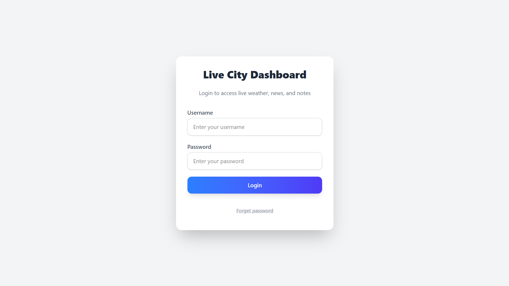
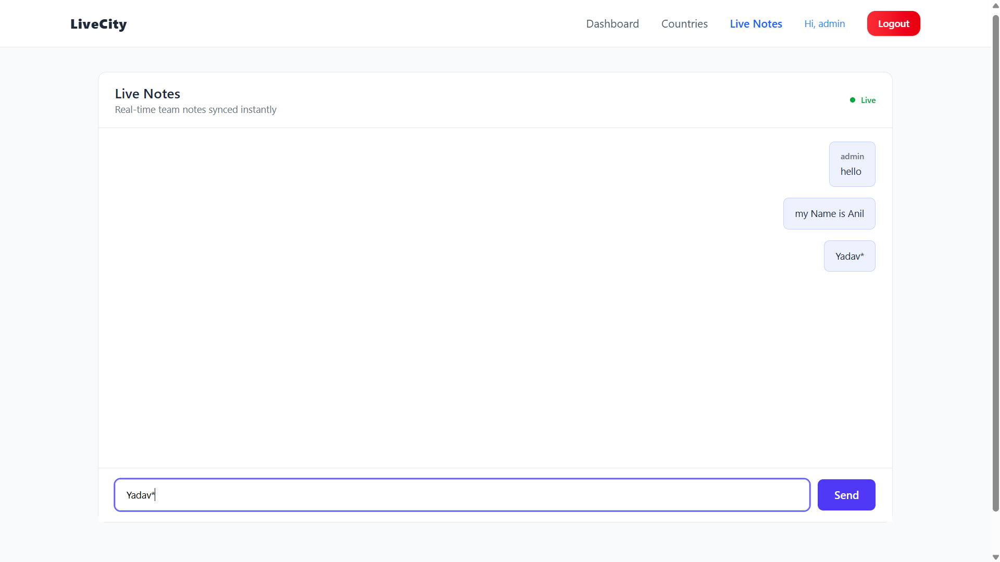

## Live City Dashboard 🌆

A React.js web app that shows live city information — weather, country details, news, real-time notes, and notifications. Built to demonstrate React fundamentals, API integration, Firebase real-time updates, and WebSocket usage, all wrapped in a clean, responsive UI.

## Features
Login & Authentication

Login via DummyJSON API

Session token saved in localStorage

Protected routes prevent unauthorized access

Logout clears session and redirects to login

## Dashboard

Weather widget (OpenWeatherMap) — search by any city

News widget (GNews API) — shows top headlines

Notification panel — real-time updates via WebSocket

Fully responsive and modern design

## Country Explorer

Browse all countries using REST Countries API

Search by name instantly

Professional country cards with flag, population, region

## Live Notes

Post notes in real-time with username and timestamp

Data stored in Firebase Firestore

Updates appear instantly across all users

WebSocket Notifications

Connects to a public WebSocket server

Live notifications with auto-reconnect

## Tech Stack

Frontend: React.js, React Router, Tailwind CSS

APIs: OpenWeatherMap, GNews, REST Countries

Database: Firebase Firestore

Realtime Messaging: WebSocket

HTTP Requests: Axios

State Management: React Hooks & Context API

## Project Structure

## Setup & Installation
1. Clone the repository:
git clone https://github.com/AnilYadav8421/live-city-dashboard.git
cd live-city-dashboard

2. Install dependencies:
npm install

3. Configure environment variables

## .env file in the project root:

VITE_WEATHER_API_KEY=your_openweathermap_api_key
VITE_NEWS_API_KEY=your_news_api_key
VITE_FIREBASE_API_KEY=your_firebase_api_key
VITE_FIREBASE_AUTH_DOMAIN=your_project.firebaseapp.com
VITE_FIREBASE_PROJECT_ID=your_project_id

4. Run the project locally:
npm run dev

5. Open in browser:
http://localhost:5173

## Screenshots

## Screenshots

### Login

### Dashboard

### Countries Page

### Live Notes

